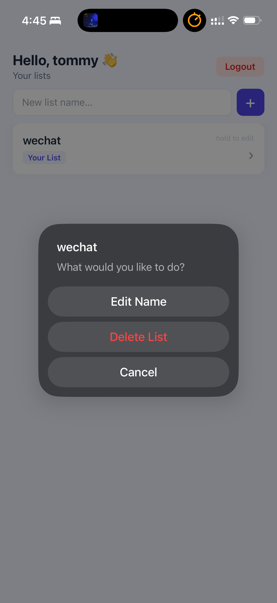
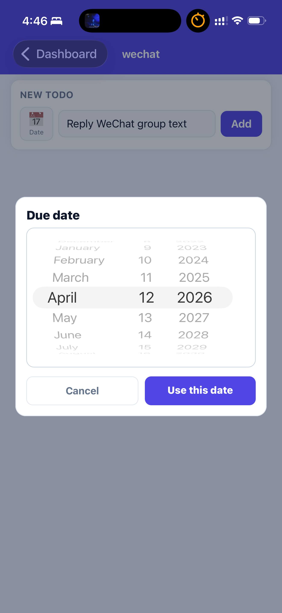
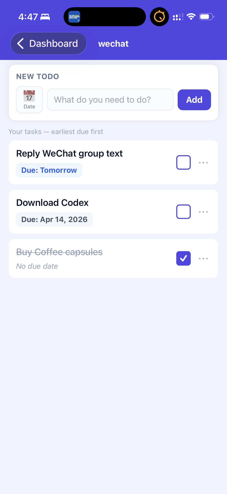

# todo-mobile-antra

A React Native mobile app built with Expo that lets you manage todo lists — create lists, add tasks with due dates, mark them complete, and share them with other users.

---

## Related Repo

The backend must be running before you start the app.

👉 Backend repo: [todo-api-antra](https://github.com/tommyvio/todo-api-antra)

---

## How to Run

### Step 1 — Find your computer's local IP

**Mac:**
```bash
ipconfig getifaddr en0
```
**Windows:**
```bash
ipconfig
# look for "IPv4 Address"
```

### Step 2 — Set the IP in the mobile app

Open `services/api.js` and update this line with your IP:
```js
const BASE_URL = 'http://YOUR_IP_HERE:3000';
```
> ⚠️ Do NOT use `localhost` — it won't work on a physical phone.

### Step 3 — Start both servers

**Terminal 1 — Start the backend:**
```bash
cd todo-api-antra
npm install
node index.js
```

**Terminal 2 — Start the mobile app:**
```bash
cd todo-mobile-antra
npm install
npx expo start
```

---

## Testing

**On your phone:**
Install [Expo Go](https://expo.dev/go) on your phone, scan the QR code that appears after `npx expo start`, and make sure your phone and your computer are on the same WiFi network.

**In the browser:**
After running `npx expo start`, press `w` to open the app in your web browser — no phone or Expo Go needed.

---

## Screenshots

| Dashboard (Owner) | List Detail | Todos with dates |
|---|---|---|
|  |  |  |

| Completed todos | Shared List View | Read-only View |
|---|---|---|
|  |  |  |

---

## Features

- Auth — signup, login, logout
- View all lists with ownership badges (Your List / Shared)
- Add todos with optional due dates
- Mark todos as complete with strikethrough
- Todos sorted by earliest due date automatically
- Long-press a list to edit its name or delete it (owner only)
- Non-owners see a read-only message and can't make changes
